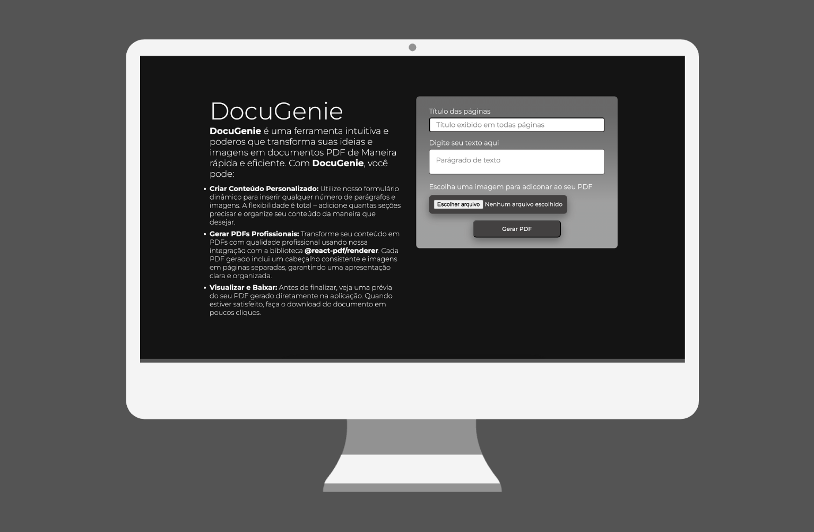
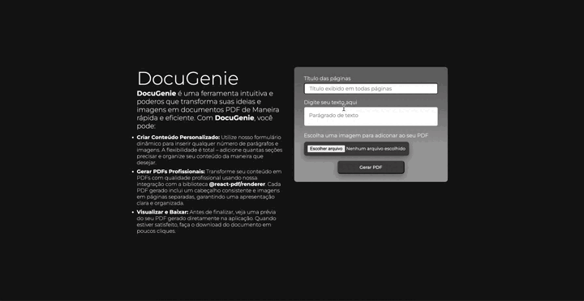

## Visão

O **DocuGeni** é ferramenta intuitiva e poderos que permite o usuario fazer que transforma suas ideias e imagens em documentos PDF de Maneira rápida e eficiente. Desenvolvida como parte de um teste técnico para a GeoGIS, com o objetivo de avaliar conhecimentos em React.JS.

## Tecnologias Utilizadas

O projeto **DocuGeni** foi desenvolvido utilizando as seguintes tecnologias:

- **Next.JS**: Estrutura de sites estáticos para aplicativos da web baseados em React.JS
- **Styled-Components**: Biblioteca que permite a criação de estilos para componentes em aplicações React e React Native.
- **Google-Fonte**: Biblioteca de fontes.
- **@@react-pdf/renderer**: Biblioteca que permite renderizar documento em PDF a partir do ambiente Web ou servidor.

## Como Clonar e Executar o Projeto

### Pré-requisitos

- Node.JS instalado
- Npm ou Yarn instalado

## Passos

1. Clone o repositório do **DocuGeni**:

```bash
https://github.com/DiogooRodrigoo/generatorPDF.git
```

2. Acesse o diretório do projeto:

```bash
cd generator-pdf
```

3. Instale as dependências do projeto:

```bash
npm install

#ou

yarn install
```

4. Execute o projeto:

```bash
npm run dev

# ou

yarn dev
```

4.1 Acesse o aplicativo em seu navegador em [http://localhost:3000](http://localhost:3000).

## Screenshots



## Demonstração



---

Com essas orientações, você conseguirá copiar o repositório, instalar as dependências e rodar o projeto **DocuGeni** no seu ambiente local. Caso precise de mais assistência, não hesite em me procurar.

Desenvolvido por Diogo Rodrigo Pedreira Galvão, 2024.
Todos os direitos de uso de imagem e atribuições deste trabalho estão diretamente relacionados à empresa GeoGIS.
